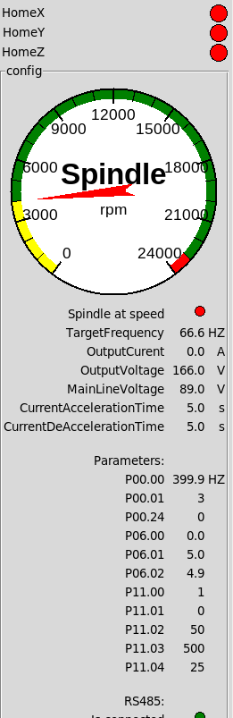

# LinuxCNC-Yalang-yl620-VFD-rs485-Modbus with VFDmod
# About
This repository should help users with the [Modbus RS485](https://en.wikipedia.org/wiki/RS-485) communication of a Yalang YL620 Variable Frequency Drive VFD and the integration in [LinuxCNC](http://linuxcnc.org/). Some more information is based in the [LinuxCNC Forum](https://forum.linuxcnc.org/24-hal-components/39128-yalang-yl620-vfd-rs485-modbus-communicaiton?start=0).

It is based on [vfdmod](https://github.com/aekhv/vfdmod).
The plan is that this repository will provide you with:
-   The [vfdmod](https://github.com/aekhv/vfdmod) config file.
-   The necessary [HAL](http://linuxcnc.org/docs/2.8/html/hal/intro.html) file for [LinuxCNC](http://linuxcnc.org/).
-   A [PyVCP](http://linuxcnc.org/docs/2.8/html/gui/pyvcp.html) file for the [Axis Ui](http://linuxcnc.org/docs/2.8/html/gui/axis.html). 

The VFD RS 485 Signal is very noisy. I used this adapter which works best for me 
https://amzn.to/4886Km0 (Amazon affiliate link)

# How to
- Set up the VFD drive to receive signals via Modbus. 
  - P00.01 = 3  Start/Stop command source RS485
  - P03.00 = 4  for 19200Bps
  - P03.01 = 1  RS485 slave address 1
  - P03.02 =  2  Data transfer format 8 bit data, 1 stop bit, no parity
  - P07.08 =  5  Frequency source selection RS 485
- Connect the VFD with your USB Rs485 adapter.
- Download vdf.hal vfd.ini and vfd.xml to your linuxcnc/config/NAME folder. Replace NAME with the name of your machine. 
- In the .ini file of your machine add under `[DISPLAY] PYVCP = vfd.xml`
- Add `loadusr -W vfdmod vfd.ini` to the custom.hal file.
- Add `source vfd.hal` to the postgui_call_list.hal file.

# Roadmap
- [X] Create the repository.
- [X] Get the basic communication running. (Start, Stop, Direction, Speed) :tada:
- [X] Have a a basic [PyVCP](http://linuxcnc.org/docs/2.8/html/gui/pyvcp.html). 
- [X] Translate the Yalang [YL620 Modbus Manual](Modbus.docx) from Chinese to English. (partly done) 
- [X] Read out feedback registers (Voltage, Current,...). Voltage and Current readings seems to be wrong, but also wrong in the VFD display. Confirm to P00.24.
- [X] Read out the parameter registers.
- [X] Display Parameter registers in a Axis Tab.
- [ ] Integrate a drop down setting for each parameter in the Axis Tab.

# Changelog
- `02. November 2021` Repository created
- `04. November 2021` Integreated the Parameter register and feedback register read out. Unfortunatley the VFD doesn't show good values in Voltage and Current. This is11n issue of the VFD since even on the display it doesn't show correct values. Updated the tab. 
- `09. November 2021` Thanks to eNnvi for the upload of the English manual. 
- `18. November 2021` Added How to section. 
- `22. November 2021` Added some more Registers. Looking for reports on the OutputVoltage and OutputCurrent readings. 
